# MSA Practice Project


Spring Boot와 Spring Cloud를 활용하여 구축한 **마이크로서비스 아키텍처(MSA) 실습 프로젝트**입니다.  
사용자 관리(User)와 게시판(Board) 서비스를 분리하고, 이를 지원하는 다양한 MSA 인프라(Gateway, Discovery, Tracing, Circuit Breaker)를 직접 구현하여 상호작용을 이해하는 것을 목표로 합니다.

---

## 🏗️ 시스템 아키텍처 (System Architecture)

이 프로젝트는 **Gateway 패턴**, **Service Discovery**, **Database per Service**, **Distributed Tracing** 등 MSA의 핵심 패턴들을 준수하여 설계되었습니다.



### 🛡️ 네트워크 및 보안 구조

실제 운영 환경을 고려하여 **DMZ**와 **Private Zone**으로 논리적 구분을 두었습니다.

1.  **DMZ (Demilitarized Zone)**
    *   **Gateway Service**: 외부 인터넷과 직접 맞닿는 유일한 접점입니다. 인증(JWT), 라우팅, 로깅을 담당합니다.
2.  **Private Zone (Trusted Network)**
    *   **Microservices (User, Board)**: 실제 비즈니스 로직을 수행하며, 외부에서 직접 접근할 수 없습니다. 오직 Gateway를 통해서만 접근 가능합니다.
    *   **Infrastructure (Eureka, Config, Zipkin)**: 시스템 운영을 위한 핵심 서버들로, 내부망에서만 통신합니다.
    *   **Data Layer (MySQL, Redis)**: 데이터베이스는 가장 깊은 계층에 위치하여 철저하게 격리됩니다.

---

## 🛠️ 기술 스택 (Tech Stack)

| Category | Technology | Version | Description |
| :--- | :--- | :--- | :--- |
| **Language** | Java | 17 | 주요 개발 언어 |
| **Framework** | Spring Boot | 4.0.0 | 애플리케이션 프레임워크 (최신 버전) |
| **Cloud** | Spring Cloud | 2024.0.0 | MSA 인프라 구축 (Gateway, Eureka, Config) |
| **DB** | MySQL | 8.0 | 관계형 데이터베이스 (서비스별 독립 인스턴스) |
| **Cache** | Redis | Alpine | 토큰 블랙리스트 및 캐싱 |
| **Communication** | OpenFeign | - | 선언적 HTTP 클라이언트 (Service-to-Service) |
| **Resilience** | Resilience4j | - | 서킷 브레이커 (장애 전파 방지) |
| **Monitoring** | Micrometer + Zipkin | - | 분산 추적 (Distributed Tracing) |
| **Build** | Gradle | 8.x | 멀티 모듈 빌드 시스템 |

---

## 📦 모듈 구성 (Modules)

| Module | Port | Role | Key Features |
| :--- | :--- | :--- | :--- |
| **gateway-service** | 8000 | 진입점 | JWT 검증, 라우팅, 요청 로깅 |
| **discovery-service** | 8761 | 서비스 발견 | Eureka Server, 서비스 레지스트리 관리 |
| **config-service** | 8888 | 설정 관리 | 중앙 집중식 설정 서버 (Native Profile) |
| **user-service** | 8080 | 회원 관리 | 회원가입, 로그인, JWT 발급, 프로필 관리 |
| **board-service** | 8081 | 게시판 | 게시글 CRUD, 댓글, 좋아요, 작성자 정보 조회 (Feign) |
| **common** | - | 공통 라이브러리 | DTO, 유틸리티, 공통 예외 처리, 보안 필터 |

---

## 🚀 시작 가이드 (Getting Started)

Docker Compose를 사용하여 전체 시스템을 한 번에 실행할 수 있습니다.

### 1. 사전 요구 사항
*   Docker & Docker Compose
*   Java 17 (로컬 개발 시)

### 2. 실행 방법
프로젝트 루트 디렉토리에서 다음 명령어를 실행합니다.

```bash
# 전체 서비스 빌드 및 실행 (Background)
docker-compose up -d --build
```

### 3. 주요 접속 정보
*   **Gateway (API 진입점)**: `http://localhost:8000`
*   **Eureka Dashboard**: `http://localhost:8761` (서비스 등록 상태 확인)
*   **Zipkin Dashboard**: `http://localhost:9411` (요청 추적 확인)

---

## 🧪 주요 기능 테스트

### 1. 회원가입 및 로그인
```bash
# 회원가입
curl -X POST http://localhost:8000/api/users/signup \
  -H "Content-Type: application/json" \
  -d '{"username":"test","password":"1234","email":"test@test.com"}'

# 로그인 (토큰 획득)
curl -X POST http://localhost:8000/api/users/login \
  -H "Content-Type: application/json" \
  -d '{"username":"test","password":"1234"}'
```

### 2. 게시글 작성 (토큰 필요)
```bash
curl -X POST http://localhost:8000/api/boards \
  -H "Authorization: Bearer <YOUR_ACCESS_TOKEN>" \
  -H "Content-Type: application/json" \
  -d '{"title":"Hello MSA","content":"Testing Circuit Breaker"}'
```

### 3. 서킷 브레이커 테스트 (장애 시나리오)
1.  `user-service` 컨테이너를 중지시킵니다: `docker stop user-service`
2.  게시글 조회 API를 호출합니다.
3.  **기대 결과**: 에러가 발생하지 않고, 작성자 이름이 **"Unknown User"**로 표시되며 정상 응답합니다.
